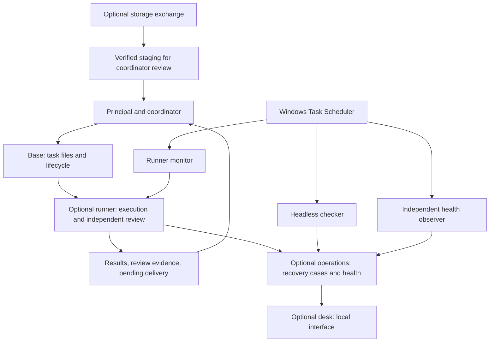

# IAF Protocol architecture

IAF means **It's All Files**. The protocol defines the records, ownership rules, and handoffs that let agents coordinate work. The tools implement parts of that contract. Provider sessions can be replaced; the task and evidence remain in the workspace.

## Task lifecycle

Intake → assignment → acceptance → execution → independent review → delivery → closure. A blocker preserves evidence and requires an explicit disposition. Scope changes and authorized corrections use new linked tasks/orders rather than rewriting accepted assignments.

The [file protocol v1](packages/portable/template/PROTOCOL.md) is the detailed contract. TEAM.md identifies the principal, active coordinator, participants, verified access, and limits. The coordinator maintains task state and explicitly notifies the next participant. The producer writes acceptance and results; the reviewer writes review evidence; the coordinator records actual delivery and closure.

## Components

The desk does not own the checker loop. Operations does not launch models, publish retries, modify the runner ledger, or close coordinator tasks. A storage packet is data for inspection, not permission to execute.

## Source of truth and ownership

| Record | Owner | Meaning |
|---|---|---|
| `tasks/<id>/task.md` and revision history | Coordinator | Scope, assignment, workflow state |
| Acceptance and results | Assigned producer; attributed scribe where explicit | Accepted scope and produced evidence |
| Review artifacts | Independent reviewer | Findings about an exact artifact version |
| Immutable `work/inbox/<id>.json` | Published by coordinator | Automated assignment |
| External local ledger | Runner only | Protected per-attempt history and replay decisions |
| `work/status`, `work/receipts`, `work/handoffs` | Runner only | Runtime projections and pending delivery |
| External operations journal | Operations only | Cases, claims, revisions, health evidence |
| `delivery.md` and closure history | Coordinator | Actual delivery and verified closure |

Automated stage outputs live under `work/results/<order-id>/`; the coordinator links that evidence into the task packet. Runtime success, reading a report, resolving a case, and closing a task are distinct facts.

## Installation and failure handling

Deployment 0.3.0 is a source preview. Manual installs the base. Automated adds the runner. Unattended adds headless operations and optional startup activation. Desk is optional for Automated or Unattended and includes its operations-code dependency; background activation belongs to Unattended.

The installer records owned files and component choices and preserves existing destinations. Removal preserves the base, modified files, tasks, results, history, configuration, and protected state. Upgrades/profile changes currently require a fresh installation plus explicit migration. See [package contracts](packages/deployment/CONTRACTS.md).

One configured Windows host serializes native Codex/Claude execution and alternate-provider review. The runner owns exclusion, ledger writes, stage-specific completion validation, timeouts, and cleanup quarantine. Missing/corrupt ledger state fails closed. An interruption does not authorize replay.

Operations preserves attempt fingerprints. Revisions and finite claim tokens prevent stale case updates; changed evidence can reopen a case. An independent observer checks checker health, and Doctor checks observer freshness. All components are on one host: they cannot repair power loss or provide off-machine outage alerts.

## Transport, compatibility, and validation

[IAF Protocol Drive](https://github.com/kyleillgen/IAF-Protocol-Drive) exports selected files with a manifest and hashes, validates inbound bytes, and stages them outside the live queue. Keep credentials, ledgers, locks, and local operations state out of sync. Live Google sync and remote delivery need separate validation.

The rename preserves protocol v1 and existing `agentos-*` identifiers, receipts, implementations, and historical archives. New entry points are aliases. See [BRANDING.md](BRANDING.md). A name change is not an installation migration.

The public package excludes private project-event replay, private automatic review-only publication, and host-specific integrations. Isolated tests do not replace real provider authentication, reviewed foreground work, scheduler activation, reboot, signed-out operation, and clean-machine removal checks. Review and storage format do not guarantee correctness, exactly-once external effects, or hostile-participant isolation.
