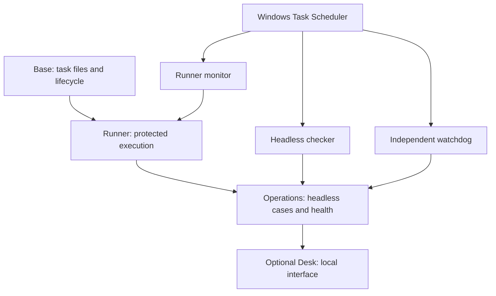

# Package boundaries

Version: deployment 0.3.0, file protocol v1, runtime v1, operations journal schema 1. This is explicit package composition; there is no plug-in loader, marketplace, runtime discovery or arbitrary installer hook.

## Ownership

| Component | Owns | May read | Must not do |
|---|---|---|---|
| Base/coordinator | tasks/<id>/task.md, assignment revisions, delivery and closure | Task evidence and independent review | Infer delivery from an execution status |
| Runner | Protected ledger; work/status, work/receipts, work/results attempt evidence, pending handoffs | Immutable work/inbox, configured policy and task context | Reset a missing ledger, replay an ambiguous attempt, let execution review itself |
| Operations | External operations journal, claims, health records, alert records, work/recovery briefs | Published orders, runtime evidence, reports, runner heartbeat | Rewrite runner records, launch models, publish a retry, close a coordinator task |
| Desk | No independent lifecycle state; calls operations request/seen commands | Operations snapshots and supported reports | Own the checker loop, execute tasks or alter the ledger |
| Storage extension | Explicit transport manifests and staging | Only allowlisted transferable files | Sync credentials/ledger/locks or treat sync as distributed locking |

Journal revisions and claim tokens refer to recovery cases only. Task revisions and delivery remain part of the base protocol. They are separate entities, not competing status files. A report read marker proves only that a particular content hash was opened.

## Dependency and compatibility rules

Manual = base. Automated = base + runner. Unattended = base + runner + operations. Desk adds operations code as a dependency, but background activation remains exclusive to Unattended. Removing the Desk has no reverse dependency on monitoring.

The runner's native Codex/Claude pair remains built in for this preview. Both are required because each independently reviews the other. Do not advertise arbitrary provider plug-ins yet. A future adapter must expose bounded process completion, provider terminal outcome, evidence paths and runtime v1 provenance to the runner; the runner retains locks, ledger writes, timeout enforcement and the final verdict decision. Unknown fields stay unknown and fail closed when required for safety. The existing runtime regression suite is the acceptance gate for extracting this boundary later.

Every extension must declare a supported base version, exact dependencies, owned files, state location, install/diagnose/remove behavior and meaningful failure tests. No extension may silently add access, accounts, paid APIs, retries or authority. File transport remains optional and does not grant another machine dispatcher ownership.

## Processes and state

One configured host runs the queue. Automated starts in the foreground. Unattended registers three independent startup tasks under one account and distinct installation-specific names: event-driven runner, event-driven checker and ten-second health observer. Windows handles crash restart. The Desk is an optional foreground server. No startup task points to a chat app, browser or agent session.

Workspace = portable task/evidence files plus installation metadata. LocalStateDirectory/ledger = runner-owned, protected replay record. LocalStateDirectory/operations = checker journal, report-read hashes, health, notifications and locks. Keep LocalStateDirectory outside file sync. These locations come from installation input; no developer-machine path belongs in a distributable.

The watchdog is independent of the checker and reads its last successful check. Doctor independently checks watchdog freshness. All components are on one host: off-machine outage alerting is a future extension, and power loss cannot be repaired by local software.

## Extraction provenance and intentional limits

The operations engine and HTTP interface were separated from the private September 13 checker after its recovery hardening. Filesystem containment, atomic writes, case fingerprinting, revisions, finite claims, evidence invalidation, complete scanning, journal archival and health observation were retained. The HTTP server does not import or start the checker service.

Private project-event replay and automatic review-only publishing were excluded: the public file protocol and immutable-order authorization contract differ. Portable recovery is explicit, evidence-backed disposition, with new linked execution published through the runner's existing authorized order command. Desktop notifications and host-specific provider/storage integrations were also excluded. These are deliberate scope limits, not silently stubbed capabilities.

## Acceptance gates

Package tests must establish fresh-directory profile contents, dependency rejection, no mutation on preflight failure, preservation on repeated install, installed-byte verification, case recovery and expiry, uncertain-outcome non-replay, independent checker health when the HTTP server is healthy, removal without record loss, scheduling-denial behavior and refusal to touch an unrelated registration.

Release validation additionally requires a clean Windows machine, real provider authentication and independently reviewed work, actual scheduled-task activation, reboot and signed-out verification. Local tests may not substitute for those results. Existing private-host migration requires a separate plan and matched workspace/local-state backup.
